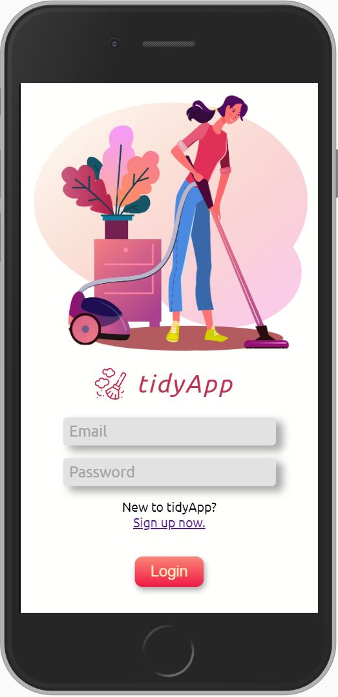

# tidyApp 🧹

<a href="https://tidyapp-rokoc.herokuapp.com/" target="_blank"></a>

tidyApp saves your relationship! It is the to do app for your household.
It supports you in creating tasks and distributing them to all household members.
You also get an overview of all tasks to be done in a day and week view. So there will never be an argument about who will do the next washing up.

<br/>

# How to use?

1. Clone the repository

```
git clone git@github.com:rokoc003/tidy_app.git
```

2. Install dependencies

```
npm install
cd client
npm install
```

If you would like to start the server and client in the development mode at the same time.

```
npm run dev
```

If you would like to run the production build, you have to build the client first.

```
npm run build
npm start
```
